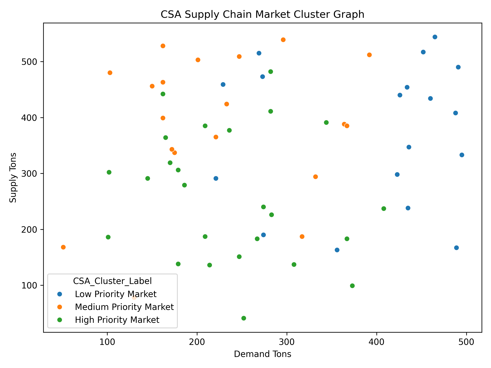

# 🌾 Smart Agricultural Supply Chain Optimization System

## 🧠 Agricultural Market Logistics Prediction using Bio-Inspired Optimization and Machine Learning

---

## 👤 Author

**Sagnik Patra**

---

## 📌 Project Overview

This project builds an end-to-end **Smart Agricultural Supply Chain Optimization System** using **Machine Learning**, **Deep Learning**, **Clustering**, and **Bio-Inspired Optimization Algorithms**.

The system uses Meghalaya agricultural market data from `megambmarketname_n.xls`, performs market-level feature engineering, applies optimization-based feature selection using **CSA**, **AIS**, and **PSO**, predicts logistics cost, ranks markets based on supply-chain priority, clusters markets into priority groups, and automatically generates reports, graphs, trained models, prediction files, configuration files, and result summaries.

The project is designed to support agricultural logistics planning, market prioritization, transportation cost analysis, and supply-chain decision-making.

---



---

## 🎯 Objectives

- Analyze agricultural market data of Meghalaya
- Predict logistics cost for agricultural supply-chain planning
- Rank markets based on predicted logistics priority
- Cluster markets into supply-chain priority groups
- Apply bio-inspired feature selection algorithms
- Train machine learning and neural network models
- Generate prediction CSV files
- Generate model result CSV files
- Generate feature selection reports
- Generate visualization graphs
- Save trained `.h5`, `.keras`, and `.pkl` models
- Save project configuration in `.yaml`
- Save summary reports in `.json`

---

## 🗂️ Dataset

The project uses the dataset:

```text
megambmarketname_n.xls
